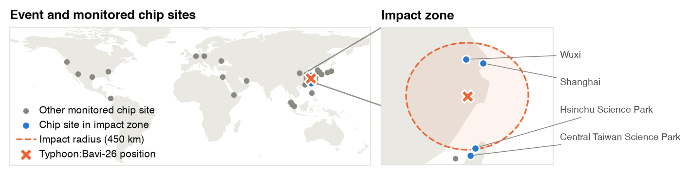
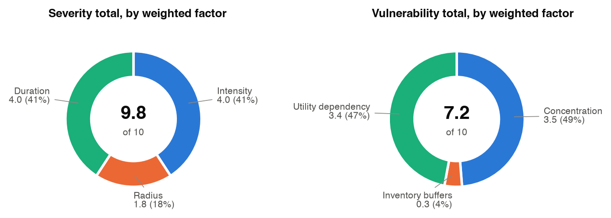
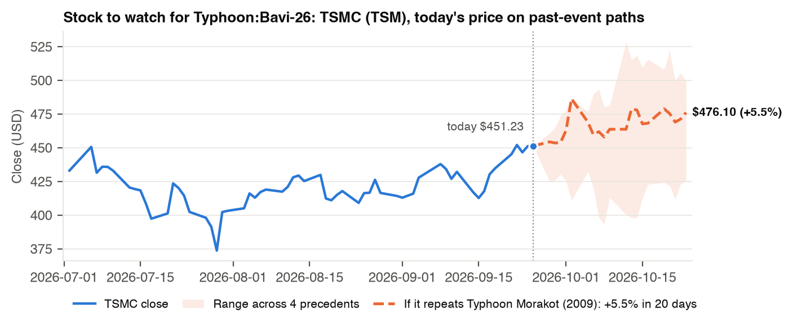

# Watchtower – Event-Driven Semiconductor Return Forecasting



**[Sample report (PDF)](docs/sample_report.pdf)** | **[Final report](docs/Final_Report.pdf)** | **[Hackathon prompt](docs/Hackathon_Prompt.pdf)**

Built for the Stevens Business + AI Hackathon (Chubb problem statement).

This is a **multi-agent, always-on research system**. It continuously scans global disaster feeds and world news, detects early signals of **hurricanes, typhoons (tropical cyclones) and tsunamis** that could hit the **semiconductor supply chain**, researches each one, estimates the expected market impact, has a critic agent check that reasoning, and issues a clear, caveated notification as Markdown, PDF and JSON.

Data sources are free and need no keys. The reasoning agents use the OpenAI API; without a key, every agent falls back to rule-based logic.

---

## Quick start

**Requirements:** Python 3.10+ and an OpenAI API key. Without a key, the agents fall back to rule-based logic.

```bash
git clone https://github.com/ivanradonjicFE/Watchtower-Event-Driven-Semiconductor-Return-Forecasting.git
cd Watchtower-Event-Driven-Semiconductor-Return-Forecasting
python3 -m venv .venv
./.venv/bin/pip install -r requirements.txt
echo "OPENAI_API_KEY=sk-..." > .env        # your key; never commit this file
```

**Run it:**

```bash
./.venv/bin/python agent_system.py --once --days 90   # demo: one cycle over the last 90 days, then opens the PDF report
./.venv/bin/python agent_system.py                    # always-on: a cycle every 5 min until Ctrl+C
./.venv/bin/python agent_system.py --reset            # forget all state and start fresh
./.venv/bin/python agent_system.py --once --no-open   # don't open the PDF automatically
```

**What to expect:** a first cycle takes about 3–5 minutes and roughly 15–25 AI calls, and prints each agent's steps in the terminal. With `--once`, it ends by writing `out/report-<time>.pdf` and opening it (macOS). Later cycles are quick unless something new or escalating appears. In live mode (no `--days`), it only reports storms from the last 10 days, so it may correctly find nothing near chip sites.

**Windows:** use `.venv\Scripts\python` instead of `./.venv/bin/python`.

The API key is read from the `OPENAI_API_KEY` environment variable, from `.env`, or from `Open_AI_API_Key.txt`, in that order.

## Outputs

| Path | Contents |
|---|---|
| `out/notifications/<time>-<LEVEL>-<event>.pdf` / `.md` | The notification: bottom line, what happened, why it matters for chips, expected market impact by segment, what to do and watch, precedents, current market reaction, caveats, evidence links |
| `out/notifications/<...>.json` | Full audit trail: the event, evidence, research brief, market view, every critic round, and every agent action |
| `out/briefs/<time>-<LEVEL>-<event>.md` | Same report section, with charts, for events analyzed but below the notify level (not notified) |
| `out/report-<time>.pdf` | With `--once`: status board plus the latest section for every analyzed active event, opened automatically |
| `out/status.md` | Live board of all active events: level, sources, market view, whether notified |
| `state.db` | The shared SQLite state (signals, events, agent log, notifications). Delete it or use `--reset` to start over |

---

## Agent architecture

```
                 ┌──────────────┐   ┌──────────────┐
  every 10 min → │ HazardScout  │   │  NewsScout   │ ← every 15 min
                 │ GDACS, NASA, │   │ GDELT: 3     │
                 │ NOAA, USGS   │   │ searches     │
                 └──────┬───────┘   └──────┬───────┘
                        └───────┬──────────┘
                                ▼   raw signals
                 ┌─────────────────────────────┐
                 │     BLACKBOARD (state.db)   │  signals · events · agent log · notifications
                 └─────────────────────────────┘
                                ▼
                 ┌─────────────────────────────┐
                 │ Triage (gpt-5.4-mini)       │  relevant to chips? which channel? credible? sensational?
                 └─────────────┬───────────────┘
                               ▼
                 ┌─────────────────────────────┐
                 │ Correlator (rules)          │  signals → events; hazard + news corroboration;
                 │                             │  relevance, severity, level; new or escalating?
                 └─────────────┬───────────────┘
                               ▼  top 3 new/escalating WATCH+ events, in parallel
        ┌─────────────────────────────────────────────────────────────┐
        │ Research (gpt-5.5) → plans + runs a follow-up news search,  │
        │                      writes brief: confirmed vs uncertain,  │
        │                      mechanisms into the chip supply chain  │
        │ Market Analyst (gpt-5.5) → precedents + live prices →       │
        │                      expected SOX move, segments, actions   │
        │ Critic (gpt-5.5) → checks claims against evidence; sends    │
        │                      back for 1 revision; sets final level  │
        │ Notifier (gpt-5.5) → notifies only if new or escalated;     │
        │                      writes md + pdf + json                 │
        └─────────────────────────────────────────────────────────────┘
```

| Agent | File | Model | Role |
|---|---|---|---|
| HazardScout | `agents/scouts.py` | none | Polls GDACS cyclones, NASA EONET storms, NOAA tsunami warnings, USGS tsunami-flagged quakes |
| NewsScout | `agents/scouts.py` | none | Runs 3 GDELT searches: cyclones/tsunamis plus chips, cyclones/tsunamis plus ports/airports/power, tsunami warnings |
| Triage | `agents/triage.py` | `gpt-5.4-mini` | Reads every new headline in batches of 40. Decides chip relevance, impact channel (fabs, materials, logistics, energy, policy, demand), credibility 0–1, and whether it's sensational. Hazards keep their rule-based distance-to-site facts |
| Correlator | `agents/correlator.py` | none | Merges signals into events. News attaches to a matching hazard (corroboration bonus) or clusters by type and region. Scores relevance, severity and level; flags new or escalating events; closes events after 72 h with no new signals |
| Research | `agents/research.py` | `gpt-5.5` | Plans and runs a targeted follow-up news search, then writes a brief citing numbered evidence |
| Market Analyst | `agents/analyst.py` | `gpt-5.5` | Interprets precedents (market moves computed by code, supply/demand shocks from Wikipedia) and live prices into an expected 20-day SOX move, segment impacts and actions. Only numbers from the data are allowed |
| Critic | `agents/critic.py` | `gpt-5.5` | Red-teams the brief and market view: unsupported claims, invented numbers, sensational sourcing, ignored counter-evidence. Can force one revision and sets the final level |
| Notifier | `agents/notifier.py` | `gpt-5.5` | Notifies only at WATCH or above, and only for new events or level increases. Writes the notification and updates `out/status.md` |

**Design principles**
- **Numbers come from code, words from models.** Distances, market reactions and projections are computed. Models interpret them and are told to use only the numbers given, and the critic checks that they do.
- **Every model call has a fallback.** If a call fails or there's no key, the agent uses the rule-based result, so the system never stops.
- **Deduplication and escalation.** State persists in SQLite, so an event is analyzed again only when it escalates (higher level, 50% more outlets, or a new hazard feed), and notified again only when its level rises.
- **Auditable.** Every agent action is logged per event and included in the notification's JSON.

## Report format

Reports follow the d-dev branch SITREP layout: short, table-driven, quantitative. Events are named `<Type>:<Name>`, e.g. `Typhoon:Saudel-26`, `Hurricane:Nolo`, `Tsunami:Vicinity Of Puerto Rico`. The type comes from the storm's basin and wind speed.

| Section | What it shows |
|---|---|
| Header | Level, label, **composite** (exposure × severity/3), lead source, corroboration, **relevance** (cosine similarity of signal text vs the semiconductor market context, same method as d-dev), exposure score |
| Bottom line / What happened | One sentence each, written by the Notifier |
| Weather Disruption Index | 0–100 = severity (wind intensity 0.4, impact radius 0.2, duration 0.4) × vulnerability (site concentration 0.4, inventory buffers 0.2, utility dependency 0.4). Under 30 GREEN, under 60 ORANGE, 60+ RED |
| Sites in the impact zone | Top exposed chip sites with distance and score |
| Historical precedents | Match score, SOX vs S&P at +5 and +20 days, supply vs demand shock mix |
| Projected market impact | Expected 20-day SOX move and range, direction, confidence, segment table |
| Market so far / Actions / How we scored this | Ticker moves, 3–4 bolded actions, scoring and agent trail |

**Charts** (matplotlib, embedded in every report section):





- **WDI pies:** two donuts showing how intensity, radius and duration make up the severity total, and how concentration, buffers and utility dependency make up the vulnerability total (weighted contributions; each donut sums to its total).
- **Map:** world view of all monitored chip sites and the storm or tsunami position, plus a zoom on the impact zone with the impact radius and the sites inside it.
- **Stock to watch:** the last 60 trading days of the stock the analyst rates most negative (one with precedent price history; otherwise the SOX index), then today's price carried forward 20 trading days along the closest precedent's actual percent path. The shaded band is the range across all precedents. These are raw price paths, not relative to the S&P 500.

## Configuration (environment variables)

| Variable | Default | Meaning |
|---|---|---|
| `FAST_MODEL` / `DEEP_MODEL` | `gpt-5.4-mini` / `gpt-5.5` | Models for triage and for the deep agents |
| `CYCLE_SECONDS` | 300 | Orchestrator heartbeat |
| `HAZARD_SCOUT_EVERY` / `NEWS_SCOUT_EVERY` | 600 / 900 | Scout schedules (seconds) |
| `HAZARD_LOOKBACK_DAYS` | 10 | How far back hazards count (`--days` overrides) |
| `MAX_EVENTS_ANALYZED_PER_CYCLE` | 3 | Cost guard on deep research |
| `NOTIFY_MIN_LEVEL` | WATCH | Lowest level that produces a notification |

**Cost:** a first cycle with three events takes about 25 model calls and roughly 60k input / 35k output tokens. Later cycles only re-triage new headlines and re-analyze escalating events.

---

## Single-shot rule pipeline (`run.py`)

The original rule-only pipeline still works and needs no key: `./.venv/bin/python run.py [--days 90] [--top 5]`. It writes `out/alert-<time>.md/.pdf` and `out/audit-<time>.json`. The agents reuse its data and rule modules, described below.

## Data sources and rule engine (shared by the agents and `run.py`)

```
 collect.py        semis.py            analogs.py + impacts.py      alert.py            to_pdf.py
┌──────────┐    ┌──────────────┐    ┌────────────────────────┐   ┌──────────────┐    ┌─────────┐
│ 1. Find  │ -> │ 2. Filter to │ -> │ 3. Historical          │ ->│ 4. Outlook   │ -> │ 5. PDF  │
│  events  │    │ chips/shipping│   │ precedents, market     │   │    + alert   │    │         │
│          │    │ + score       │   │ reaction, supply/demand│   │              │    │         │
└──────────┘    └──────────────┘    └────────────────────────┘   └──────────────┘    └─────────┘
```

### 1. Find events (`collect.py`)

| Source | What it gives us | Key |
|---|---|---|
| [GDACS](https://www.gdacs.org) (UN/EU) | Tropical cyclones (hurricanes/typhoons) with Green/Orange/Red alert levels | None |
| [NASA EONET](https://eonet.gsfc.nasa.gov) | Open severe storms (latest position) | None |
| [NOAA tsunami.gov](https://www.tsunami.gov) | Official bulletins from the US tsunami warning centers: Warning (Red), Advisory/Watch (Orange), Information (Green) | None |
| [USGS](https://earthquake.usgs.gov) | M4.5+ earthquakes from the past week **with the tsunami flag** | None |
| [GDELT](https://www.gdeltproject.org) | Global news from the last 72 hours, 3 searches (below) | None |

**Scope:** tropical cyclones and tsunamis only. Earthquakes without a tsunami, floods, wildfires, geopolitics, trade and shipping-lane news are deliberately excluded.

GDELT searches:
- **cyclones + chips:** typhoon, hurricane, tropical storm, cyclone or tsunami, plus semiconductor, TSMC, chipmaker, foundry, fab, wafer
- **cyclones + logistics:** typhoon, hurricane, tropical storm or tsunami, plus port, shipping, airport, power outage, factories, evacuation
- **tsunami warnings:** tsunami warning, advisory or alert

GDELT results are cached in `.cache/` for 15 minutes. If GDELT throttles the run, it falls back to the last cached result, and after two throttled searches in a row it stops querying GDELT for that run.

### 2. Filter to semiconductors (`semis.py`)

A hand-built list of **29 sites** the chip industry depends on:
- fab clusters: Hsinchu, Tainan, Gyeonggi, Kumamoto, Arizona, and others
- packaging and test: Penang, Philippines
- equipment: ASML in Veldhoven
- materials: Spruce Pine quartz, Ukrainian neon
- shipping chokepoints: Taiwan Strait, Malacca, Hormuz, Suez, Red Sea, Panama

Each site has an importance weight from 0 to 1.

**Hazards** are matched by distance, using an impact radius for each event type:

| Event type | Radius |
|---|---|
| Tropical cyclone | 450 km, plus sites in an affected country within 500 km (Orange/Red alerts) |
| Tsunami | `200 × 2^(magnitude − 7)` km, at least 150 km: about 200 km for M7, 400 km for M8, 800 km for M9 |

Floods, droughts and storms also match sites in an affected country if the event is within 500 km, because these are often reported at a country's center point.

```
relevance = site weight × alert factor (Red 1.0 / Orange 0.6 / Green 0.3) × distance decay
```

Events scoring below 0.12 are dropped.

**News** stories are kept if their headlines either:
- mention chips, chip materials or shipping lanes along with a disruption, or
- describe a war, chokepoint closure or trade restriction in a chip- or shipping-critical region.

Headlines are grouped into stories by category and region. More distinct outlets means higher relevance and severity. Alarmist headlines ("crisis", "chaos", very negative tone) are flagged. If a story is mostly alarmist and fewer than two sober outlets confirm it, its relevance is cut and its severity capped.

**Severity:** 1 minor / 2 moderate / 3 major.
- **Hazards:** from the alert level; for tsunamis also from magnitude (8.0+ is major, 7.0–7.9 moderate).
- **News:** from the number of distinct outlets (10+ is major, 4–9 moderate).

**Alert level:** `relevance × severity / 3`. 0.5 or more is **WARNING**, 0.2 or more **WATCH**, lower **ADVISORY**.

### 3. Historical precedents (`analogs.py`, `impacts.py`)

The list has 15 weather precedents:
- **Typhoons:** Morakot 2009, Soudelor 2015, Gaemi 2024 and Krathon 2024 (Taiwan); Jebi 2018 and Hagibis 2019 (Japan); Mangkhut 2018 (Hong Kong/Guangdong); Hinnamnor 2022 (Korea)
- **Hurricanes and US storms:** Harvey 2017, Ida 2021, Helene 2024 (Spruce Pine quartz), Winter Storm Uri 2021 (Austin fabs)
- **Tsunamis:** Tōhoku 2011 and Indian Ocean 2004
- **Related:** Thailand floods 2011

Out-of-scope precedents (earthquakes, geopolitics, trade, fires, shipping) are kept in `analogs.py` as `OUT_OF_SCOPE_ANALOGS` but not used.

For each current event, the four most similar precedents are picked by event type and region.

- **Market reaction:** computed live from Yahoo Finance (`yfinance`). It's the semiconductor index (SOX) return minus the S&P 500 return, at +1, +5 and +20 trading days after the precedent. Nothing is hard-coded.
- **Supply vs demand shocks:** each precedent's Wikipedia article is fetched live on every run. Its economic sentences are sorted into supply shocks (production, shortages, shipping, outages) and demand shocks (sales, orders, spending, revenue) by keyword rules. Source links are printed in the alert.

### 4. Outlook (`alert.py`)

- **Expected move:** a similarity-weighted average of the precedents' +20-day SOX reactions. Each one is scaled by current severity ÷ precedent severity, limited to between 0.33× and 1.5×.
- **Confidence:** high, medium or low, based on how many close precedents there are and whether they agree on direction.
- **Market read:** compares the expected move with how the sector has actually moved relative to the S&P 500 since the event began, over at most 20 trading days. The verdict is one of: reaction may still be ahead / partly priced in / priced in / moving opposite to history / too large to blame on the event.

### 5. Alert contents

For each event, the alert has:
- the alert level
- the source link
- relevance, severity and region
- which sites are in the impact zone
- a precedents table (market moves plus supply and demand shocks)
- the current reaction of SOX, TSMC, Micron, ASML, Intel and ZIM
- the outlook
- a "How we scored this" audit section

The alert ends with caveats.

---

## How this maps to the Chubb prompt

| Prompt asks for | Where |
|---|---|
| Continuously running, multi-agent | `agent_system.py` loop; scouts on their own schedules; 7 specialized agents sharing a SQLite blackboard |
| Monitor diverse global sources | HazardScout (GDACS, NASA EONET, NOAA tsunami.gov, USGS) and NewsScout (3 GDELT searches) |
| Synthesize signals to spot events before they're headline news | Triage reads every headline; Correlator merges hazard feeds and news into events and flags escalation; alarmist coverage discounted unless corroborated |
| Score severity, spread and time horizon with an auditable rationale | Correlator scores plus the Research brief (mechanisms, time horizon, confirmed vs uncertain); per-event agent log in the notification JSON |
| Market impact | Market Analyst: expected SOX move, segment and ticker exposure, base and risk cases, actions. The Critic checks it |
| Notify with clear, timely, caveated alerts | Notifier: only new or escalating events at WATCH+, caveats including unresolved critic objections, `out/status.md` board. Files only; no push delivery yet |

---

## Files

| File | Purpose |
|---|---|
| `agent_system.py` | **Always-on orchestrator for the multi-agent system** |
| `agents/` | Scouts, Triage, Correlator, Research, Market Analyst, Critic, Notifier |
| `charts.py` | Report figures: WDI factor pies, event + chip-site map, price projection for the stock to watch |
| `scoring.py` | Report scores: cosine relevance (ported from the d-dev branch), Weather Disruption Index, `<Type>:<Name>` event labels |
| `llm.py` | OpenAI wrapper: strict JSON schemas, retries, token accounting, fallback |
| `store.py` | SQLite blackboard shared by the agents |
| `config.py` | Models, schedules, thresholds, key loading |
| `run.py` | Single-shot rule pipeline (no key needed) |
| `collect.py` | Step 1: collectors, deduplication, GDELT cache |
| `semis.py` | Step 2: site list, hazard and news scoring |
| `analogs.py` | Step 3: precedent list, price data, market reactions |
| `impacts.py` | Step 3: Wikipedia supply/demand extraction |
| `alert.py` | Steps 4–5: outlook and alert text |
| `to_pdf.py` | Markdown alert to PDF |
| `requirements.txt` | Python dependencies |

---

## Known limitations

- **Keyword-sorted shocks.** The supply/demand sorting of precedent sentences is still rule-based, so some sentences are misfiled. The agents read these sentences critically, but the table shows them unedited.
- **Few precedents.** There are 15 weather precedents; tsunamis have only two, so tsunami outlooks lean on Tōhoku.
- **Market noise.** Precedent returns include unrelated market moves from the same period, like the July 2024 tech selloff after Typhoon Gaemi.
- **"In the impact zone" is not "affected".** Sites are flagged by distance only; nothing yet checks whether a fab actually shut down.
- **One location per hazard.** GDACS gives a single point per event (often a storm's last position), not its full track.
- **Rate limits.** GDELT and Wikipedia both throttle bursts. Wait about 10 minutes between runs if you see `GDELT throttled`.
- **Short windows.** News covers the last 72 hours; the USGS feed covers the last week.
- **Tsunami coverage.** NOAA's feeds show only the latest bulletin from each US warning center; tsunamis handled only by other agencies (e.g. Japan's JMA) are caught through USGS and news.
- **Headlines only.** The agents read headlines and metadata, not full article text.
- **Model output varies.** The critic and schemas constrain it, but two runs can word things differently or land on a different level.

## Next steps

1. **Delivery:** send alerts to Slack, Discord or email, routed by audience (insurers, health systems, investors).
2. **Health and Insurance briefs:** exposed population and health-system strain; affected lines of business (property, business interruption, marine cargo, contingent BI) and reserving notes.
3. **Confirmation step:** search news for "site/company + shutdown/halt/evacuate" to upgrade sites from in the impact zone to confirmed affected.
4. **More precedents:** more tsunami and hurricane cases, and storm tracks instead of single points.
5. **Full-text reading:** fetch and read article bodies for the top evidence items.

---

*Automated early-warning signal. Not investment or underwriting advice.*
